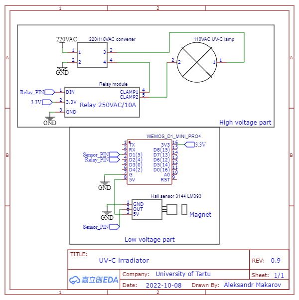
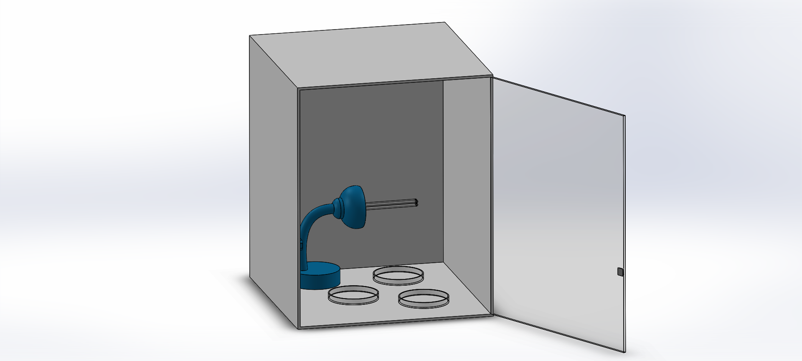

# uv_irradiator_Estonia_TUIT

The device is a chamber with a UV lamp controlled by a relay which is in turn controlled by the esp8266 that has Internet access and communicates with the end user via a telegram bot. There are two modes of operation: safe and hazardous. In safe mode the exposure is interrupted if the door is open and the hall sensor does not sense the magnet that is on the door. In hazardous mode, however, the radiation is not interrupted if the door is opened. The radiation timer can be set manually and can be set at a desired dose and distance from source to target.

## Code modifications:
> It is required to create a telegeram bot and provide its' token. Also, specify your wifi credentials and chat id of the user who wants to get notofocations on startup. For additional inforamtion refer to this [resource](https://randomnerdtutorials.com/telegram-control-esp32-esp8266-nodemcu-outputs/).

## Table of components
|Component name|Price at the moment of purchase(EUR)|
|--------------|------------------------------------|
|[230/110VAC converter EUR-US](https://www.oomipood.ee/product/poco104_muundur_230_110vac_45w_us_pesa_maandusega?q=Us&fbclid=IwAR2Q5OGo5IAuMV-56kWYeOYzeIHwe7mNA24Dvv0fcwiO6HL_E25mDY1Wodc)|18.00|
|[UV-C 25W Lamp 254nm 110V](https://www.amazon.com/dp/B09VC49Q4B?psc=1&ref=ppx_yo2ov_dt_b_product_details)|26.32 (without delivery)|
|Eur-Us plug adapter|3.00|
|Relay module|5.00|
|Lamp from supermarket|15.00|
|esp8266 nodemcu|10.00|
|hall sensor|1.5|
|magnet|1.0|
|Total(excluding shipping)|79.82|

## Schematic:

## 3d Render

